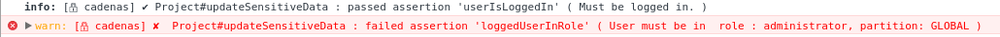

# *Serrurier*, a declarative extension for methods access control in [jagi:astronomy](http://jagi.github.io/meteor-astronomy/) using decorators

> **ℹ** *Serrurier* and *cadenas* are french words that stands respectively for *locksmith* and *padlock*.  
> **✔** This library aims to write more secure, maintainable and readable code, by defining function access through properties, via decorators.  
> **✔** It integrates smoothly with [alanning:meteor-roles](https://github.com/alanning/meteor-roles).  
> **✔** Allows to easely report suspect activity and Errors through [builtin or custom reporters](#reporters).

``` bash
meteor add svein-serrurier
```

## &#x1f512; *`@cadenas`* decorator
### Basics

> **ℹ** A *`@cadenas`* is an assertion that will trigger a specific `Exception` when it fails.  
> **ℹ** This (or those) assertions are run both **client** side and **server** side.  
> **ℹ** Those Exceptions are handled [by reporters](#reporters).  
> **ℹ**  The general syntax for *`@cadenas`* is `@cadenas( cadenasName, ...params )`  
> **ℹ** *`@cadenas`*  can target any function inside a `methods` description block.
> **ℹ** *`@cadenas`* can target any `events` handlers but **not in an array of handlers**. On any `Error` thrown by a cadenas, `e.preventDefault()` will be called.  
> **ℹ** It supports callbacks for `methods`.
> **ℹ** *Serrurier* is a very modular library and you can easely write your own *`@cadenas`* [within few lines of codes](#write-cadenas).   
> **⚠** To use decorators in your meteor project `@`), [follow those 2 straightforward steps](#decorators).  
> **⚠** To use `loggedUserInRole` *`@cadenas`*, you need to add `svein:serrurier-cadenas-roles` to your project.
> ```
> meteor add svein:serrurier-cadenas-roles
> ```

``` javascript
import { Serrurier, cadenas } from 'meteor/svein:serrurier';
import { Mongo } from 'meteor/mongo';

const Project = Serrurier.createClass({
  name: 'Project',
  collection: new Mongo.Collection( 'projects' ),
  methods: {
    // This is it
    @cadenas( 'loggedUserInRole', 'administrator' )
    updateSensitiveData() {
      // ...
      console.info( 'The assertion passed, user is administrator.' );
    }
  }
});
```
Then, if logged user is not in role 'administrator' and calls
``` javascript
(new Project()).updateSensitiveData();
```
This will output in the console ( if `Serrurier.silence()` has not been called ) :


Notice that the cadenas `'userIsLoggedIn'` has passed, because `'loggedUserInRole'` cadenas depends on it.

### List of available *`@cadenas`*

If you want, and you should, write your own cadenas, [go to this section](#write-cadenas).

#### `@cadenas( 'userLoggedIn' )`

> **asserts** that the user is logged in, with `Meteor.userId`.  
> **targets** `methods`, `events`  
> **throws** `SecurityException`  

#### `@cadenas( 'loggedUserInRole', role_s, partition )`

**⚠** You need to use [alanning:meteor-roles](https://github.com/alanning/meteor-roles) in your project to use this one, and add the following plugin :

```
meteor add svein:serrurier-cadenas-roles
```

> **asserts** that the logged user has role(s) in a specific scope (partition). Throws an error if it fails.  
> **targets** `methods`, `events`  
> **throws** `SecurityException`  
> **depends** on `'userLoggedIn'` (will always check that user is logged in first)
> **params**  
> > *role_s* One single or an array of role(s), i.e. string(s).   
> > *partition* The scopes in which the partition will apply.   
> >


#### `@cadenas( 'matchParams', paramsDescription )`

> **asserts** that all methods arguments match the given paramsDescription, and throws an error if at least one match fails.  
> **targets** `methods`  
> **throws** `ValidationError`  
> **params**  
> > *paramsDescription* An array of [Meteor Match Patterns](https://docs.meteor.com/api/check.html#matchpatterns)


#### `@cadenas( 'persisted' )`

> **asserts** that the instance it is being called upon has been persisted (with `_isNew` property to false)  
> **targets** `methods`, `events`  
> **throws** `StateException`  

## *`@server`* decorator

> ```
> meteor add svein:serrurier-decorator-server
> ```  
> **ℹ** Applies to `methods` only.  
> **ℹ** Performs server-side only, you must provide a callback as last argument if you need the return value.  
> This callback has the following signature : `callback( [ Error ] error, { * } result )`

```javascript
import { Serrurier, server } from 'meteor/svein:serrurier';

//...
    @server()
    aMethodThatMustExecuteOnServer() {
      console.info("Look, I'm running on server only.");
    }

```

Calling `aMethodThatMustExecuteOnServer` from client will call it on server. In the background, a Meteor method will be registered with the name `/serrurier/ClassName#methodName` through `Meteor.methods`.

<a name='decorators'>
## Adding legacy decorations (Meteor >= 1.3.4)
Follow those two simple steps :

> `meteor npm install -s babel-plugin-transform-decorators-legacy`

Then add at the root of your project a `.babelrc` file with the following content :
``` json
{
  "plugins": [
    "transform-decorators-legacy"
  ]
}
```
That's all you have to do!
## In production

You can prevent `Serrurier` from outputting anything in the console with one single `Serrurier.silence()` at the beginning of your application.

``` javascript
import Serrurier from 'meteor/svein:serrurier';
import 'meteor/jboulhous:dev'; // adds `Meteor.isDevelopment` flag

if(!Meteor.isDevelopment) Serrurier.silence();

```
<a name="reporters">
## reporters

A reporter is exactly like an event listener for errors.   
For each type of error, i.e. `SecurityException`, `StateError` and `ValidationError`, you can register a reporter.
By default, there is no reporting : the errors are just thrown up to the method call.
To add a reporter :

``` javascript
import { Serrurier, SecurityException } from 'meteor/svein:serrurier';

Serrurier.registerReporter( SecurityException, function( error ) {
    console.info( error._context );
    // do stuff, like calling a Meteor method
});
```

If you need a reporter that is executed on server, but listens to both client and server side errors, you can call the `Serrurier.registerServerReporter` helper.

### Paranoid reporter
This reporter fit bests for `SecurityException`.
```
meteor add svein:serrurier-reporter-paranoid
```


```
_______________________________ SERRURIER SECURITY REPORT _______________________________
{
        createdAt: new Date('2016-07-07T05:46:25.005Z'),
        ip: '127.0.0.1',
        userAgent: 'Mozilla/5.0 (X11; Linux x86_64) AppleWebKit/537.36 (KHTML, like Gecko) Ubuntu Chromium/50.0.2661.102 Chrome/50.0.2661.102 Safari/537.36',
        securityContext: {
                reason: 'User must be in  role : administrator, partition: GLOBAL',
                errorId: 'cadenas:logged-user-in-role',
                descriptor: 'Project#updateSensitiveData',
                target: {
                        Project: {
                                _removed: false,
                        }
                },
                userId: 'JCwWgQZLExz5KrcDH'
        }
}
_________________________________________________________________________________________
```
//TODO write doc

<a name="write-cadenas">
## Write your own *`@cadenas`*

### Composition with `Cadenas.partialFrom`

``` javascript
import { Cadenas } from 'meteor/svein:serrurier';
import { Match } from 'meteor/check';
/**
 * Assert the logged user is administrator
 */
const loggedUserIsAdmin = Cadenas.partialFrom( 'loggedUserInRole' , {
    name: 'loggedUserIsAdmin',
    reason: 'Must be admin.'
}, 'administrator' );

```
Later in your project

``` javascript
    @cadenas( 'loggedUserIsAdmin' )
    methodThatMustBeRunByAdmin() {
      // Will be run by 'administrator'
    }
```

### From scratch

```javascript
const myCustomCadenas = new DefaultCadenas({
    name: 'myCustomCadenas',
    reason: '',
    // [optional] This will fall back to SecurityException if none provided
    errorCtor: StateError
    doesAssertionFails: function( myArg ) {
        // Does it need to throw an error ?

    },
    // [optional] What is the cadenas signature (i.e. `doesAssertionFails` signature)?
    matchPatterns: [ Match.Optional( String ) ],
    // [optional] A set of depending assertions in the form of a dictionary which keys are cadenas names, and values an array with their `doesAssertionFails` params.
    dependingCadenas: { userIsLoggedIn: [] }
});
```
